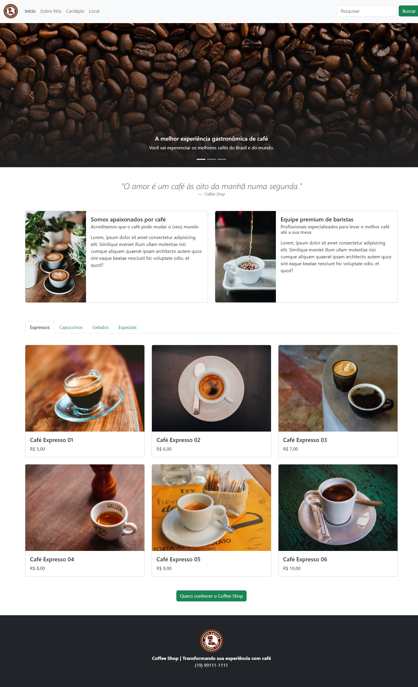

# DIO - Trilha de CSS - Página com Framework Bootstrap  

  
  

Este repositório contém a atividade prática do Curso de **Formação CSS Web Developer** da **DIO**, com o tema da matéria de *"Framework em CSS: Bootstrap"*, com a aplicação prática dos conhecimentos estudados para **construir uma página com layout responsivo**, utilizando ` HTML, CSS e Bootstrap`.

:computer: Sobre a Atividade

**Construir uma página de uma Coffee Shop com layout responsivo, utilizando o Bootstrap**

Esta atividade foi realizada com a orientação da instrutora Michele Ambrosio, da DIO, e consiste em produzir uma página para uma cafeteria. 

Dessa forma, pudemos aprimorar nossos conhecimentos em CSS, utilizando o framework Bootstrap, uma ferramenta poderosa, que possibilita a criação de um layout moderno, intuitivo e responsivo, sendo adaptável a diferentes dimensões de telas.

O resultado é uma página agradável, com potencial para atender qualquer negócio do ramo, para servir como ferramenta de apresentação do negócio, para atrair e encantar novos clientes:

 

*SDG*

## :link: Links Úteis
[Site da DIO](https://www.dio.me)

[W3 Schools - HTML](https://www.w3schools.com/html/)

[W3 Schools - CSS](https://www.w3schools.com/css/default.asp)

[MDN Web Docs - HTML](https://developer.mozilla.org/pt-BR/docs/Web/HTML)

[MDN Web Docs - CSS](https://developer.mozilla.org/pt-BR/docs/Web/CSS)

[Bootstrap - Framework](https://getbootstrap.com/)

[Unsplash - Imagens](https://unsplash.com/pt-br)
